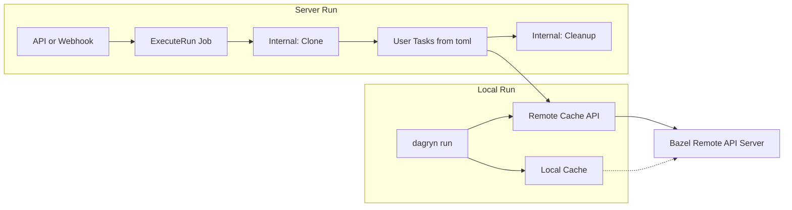

# Plan: Remote Cache (Bazel Remote APIs) and Remote Run Execution

This document updates the strategy for **remote cache sharing**, **remote run execution**, **provider webhooks**, and **adding projects from the UI**:

1. **Remote cache:** Use [Bazel Remote APIs](https://github.com/bazelbuild/remote-apis) for remote cache sharing (CAS + Action Cache).
2. **Remote run execution:** Hybrid model — run **local jobs locally** (CLI); run **provider-triggered (GitHub/GitLab/Bitbucket) or API-triggered runs on the server**, with **internal tasks**: **clone** → user tasks from `dagryn.toml` → **cleanup**.
3. **Webhooks:** For GitHub/GitLab/Bitbucket-linked projects, **tasks run on provider events**. Receive webhooks from the provider, parse event, resolve project by repo, trigger run (clone → user tasks → cleanup) with ref from the event.
4. **Add project from UI:** User can **add a project using their GitHub account** by pulling **all repos they have access to** from GitHub, selecting a repo, and creating the project (optional webhook registration). Same pattern later for GitLab/Bitbucket.

---

## 1. Remote cache sharing (Bazel Remote APIs)

### Goal

Share task cache across machines and runs by using a [Remote Execution API](https://github.com/bazelbuild/remote-apis)–compatible backend for **caching only** (no requirement to use the Execution service for running actions).

Relevant services from [remote-apis](https://github.com/bazelbuild/remote-apis/tree/main):

- **ActionCache:** `GetActionResult`, `UpdateActionResult` — look up / store results by action digest.
- **ContentAddressableStorage (CAS):** `FindMissingBlobs`, `BatchUpdateBlobs`, `BatchReadBlobs` — store/retrieve blobs by content digest (SHA256 + size).
- **Capabilities:** `GetCapabilities` — discover digest function and limits.

### Current Dagryn cache

- [internal/cache](internal/cache): local-only. `Cache` uses `Store` (filesystem under `.dagryn/cache`), `HashTask` (SHA256 of name, command, env, workdir, inputs), `Check`/`Restore`/`Save` per task.
- Cache key is a SHA256 hex string; no digest size today (could map to Remote API `Digest` with `size_bytes`).

### Integration approach

1. **Optional remote cache backend**
   - Add a cache backend (e.g. `internal/cache/remote` or `internal/remote/cache`) that implements the same high-level contract as the current cache: `Check(t) -> (hit, key, error)`, `Restore(t, key)`, `Save(t, key, duration)`.
   - Under the hood:
     - **Key:** Map Dagryn cache key to Remote API `Digest` (e.g. SHA256 hash + size of the “action” blob). The “action” could be a canonical encoding of (task name, command, env, workdir, input file digests) to align with ActionCache semantics, or a simpler mapping (e.g. current key + size of metadata).
     - **Check:** Call `ActionCache.GetActionResult(actionDigest)`. If found, optionally fetch output blobs from CAS (BatchReadBlobs) and restore to local store or workspace.
     - **Save:** Upload output blobs to CAS (BatchUpdateBlobs), then call `ActionCache.UpdateActionResult` with the action digest and references to output digests.
   - Use [remote-apis Go client](https://github.com/bazelbuild/remote-apis#go-for-non-bazel-build-systems), e.g. `repb "github.com/bazelbuild/remote-apis/build/bazel/remote/execution/v2"` and a gRPC client to a Remote API–compatible server (e.g. [bazel-remote](https://github.com/buchgr/bazel-remote), BuildBuddy, or custom).

2. **Configuration**
   - Config (e.g. `dagryn.toml` or env) to enable remote cache and set endpoint (and optional instance name, auth). When enabled, scheduler uses remote backend for Check/Restore/Save; optionally fall back to local on error.

3. **Digest and action encoding**
   - Decide canonical encoding for “Dagryn action” (inputs + command + env) so that the same logical task produces the same digest across clients. Use SHA256 for digest function to match existing [internal/cache/hasher](internal/cache/hasher.go).

### Deliverables

- Remote cache client/backend speaking ActionCache + CAS.
- Config flag and endpoint for remote cache.
- Wire scheduler to use remote cache when configured; keep local cache as fallback or primary when remote is disabled.

---

## 2. Remote run execution (hybrid: local vs server, internal tasks)

### Goal

- **Local runs:** Continue to execute on the user’s machine (CLI). Optionally sync status/logs to server (`--sync`) and optionally use remote cache.
- **Server runs (e.g. GitHub):** Execute on the server. The effective DAG includes **internal tasks** plus **user tasks** from `dagryn.toml`: **clone** → user tasks → **cleanup**.

### Internal / synthetic tasks

The server builds an **effective task list** that includes:

1. **Clone (internal)**  
   - Clone the repo (ref from trigger: e.g. branch/commit from GitHub webhook or API trigger).  
   - Output: workspace directory.  
   - No user config; system-defined.

2. **User tasks (from `dagryn.toml`)**  
   - Loaded from config in the cloned repo (or from a stored/config path).  
   - Same task definitions as today (command, needs, inputs, outputs, env, etc.).

3. **Cleanup (internal)**  
   - Remove or archive the workspace after the run.  
   - System-defined.

Dependencies:

- All user tasks that have no `needs` (or only internal deps) depend on **clone**.
- **Cleanup** depends on all user tasks (or on a single “end” task if you model it that way).

So the effective DAG is: `clone` → [user tasks as defined in toml] → `cleanup`.

### Execution flow (server)

1. **Trigger:** Webhook (e.g. GitHub push) or API `POST /projects/:id/runs` with targets and git ref.
2. **Create run record** (existing: status `pending`).
3. **Enqueue job** (e.g. `ExecuteRun`): payload = project ID, run ID, targets, git ref (branch/commit), repo URL.
4. **Job handler:**
   - Clone repo at ref into a workspace (e.g. per-run directory).
   - Load `dagryn.toml` from workspace, build workflow, **inject internal tasks** (clone already done; mark clone as success; add cleanup as final step depending on all user targets).
   - Run scheduler over the effective DAG (clone already completed; run user tasks; then cleanup).
   - Report task start/complete and logs via existing run APIs (CreateTask, UpdateTaskStatus, AppendLog, Heartbeat).

### Local vs server

- **Local:** `dagryn run [targets]` (optional `--sync`). No clone/cleanup; run user tasks only on local machine; optional remote cache.
- **Server:** Triggered by API or webhook. Run clone → user tasks → cleanup on server; optional remote cache on server.

### Deliverables

- Internal task definitions: **clone** (repo ref, output dir), **cleanup** (remove workspace).
- Workflow builder that merges internal tasks with config tasks and sets dependencies (clone first; cleanup last).
- Job `ExecuteRun` (or equivalent): clone → load config → build merged DAG → run → cleanup; report via run APIs.
- Wire TriggerRun (and optionally webhook) to enqueue this job.
- Document that “GitHub” or “server” runs use this internal-task DAG.

---

## 3. Diagram: cache and execution

---

## 4. Implementation order (suggested)

1. **Remote cache:** Implement remote cache backend (ActionCache + CAS), config, and wire into scheduler; keep local cache as default/fallback.
2. **Internal tasks:** Define clone and cleanup as internal tasks; implement workflow merger (clone + user tasks + cleanup) and dependency wiring.
3. **ExecuteRun job:** Implement job handler (clone → load config → run merged DAG → cleanup); report via existing run APIs; enqueue from TriggerRun (and later from webhook).
4. **Project–repo binding:** Add `repo_url` (and optionally `provider`, `webhook_secret`) to project model/DB or a link table; use for webhook routing and clone URL (needed for both webhook and add-from-UI).
5. **Webhook feature (Section 5):** Public webhook routes (GitHub/GitLab/Bitbucket), signature verification, webhook job (parse event → resolve project → create run → enqueue ExecuteRun with ref).
6. **Add project from UI (Section 6):** GitHub token storage (e.g. at login with repo scope or “Connect GitHub”); `GET /api/v1/providers/github/repos`; UI “Import from GitHub” → list repos → select repo → create project with repo_url; optionally register webhook with provider.

---

## 5. Webhook feature (GitHub / GitLab / Bitbucket)

### Goal

For GitHub-, GitLab-, and Bitbucket-linked projects, **tasks run when the provider sends an event**. The server receives provider webhooks, parses the event, finds the linked project, and triggers a run (clone → user tasks → cleanup) with ref (branch/commit) from the event.

### Flow

1. **Webhook endpoint:** Public HTTP endpoint (e.g. `POST /api/v1/webhooks/:provider` or `/webhooks/github`, `/webhooks/gitlab`, `/webhooks/bitbucket`) that:
   - Receives the raw request (body + headers).
   - Optionally verifies signature (e.g. GitHub `X-Hub-Signature-256`, GitLab `X-Gitlab-Token`, Bitbucket signing).
   - Identifies provider and looks up which project is bound to this repo (by repo URL or external ID).
   - Dispatches to a background job so the HTTP handler returns quickly (e.g. 200 OK).

2. **Webhook job (existing stub):** [internal/job/handlers/webhook.go](internal/job/handlers/webhook.go) currently returns `nil`. Extend it to:
   - Decrypt/decode payload (if encrypted) and parse provider-specific event (e.g. GitHub `push`, `pull_request`; GitLab `push`, `merge_request`; Bitbucket `repo:push`, `pullrequest`).
   - Extract: repo identifier (owner/repo or clone URL), ref (branch/tag), commit SHA, event type.
   - Resolve **project:** lookup project by repo URL or by stored provider + external repo ID.
   - If no project is linked, ignore or log.
   - **Trigger run:** create run record (status `pending`), enqueue **ExecuteRun** job with project ID, run ID, targets (e.g. default workflow or configurable), git ref (branch/commit) from event.
   - Reuse same ExecuteRun job as API-triggered runs (clone → user tasks → cleanup).

3. **Project–provider binding:** Projects that are “from GitHub/GitLab/Bitbucket” need to be identifiable for webhook routing. Options:
   - Store **repo URL** (and optionally **provider**, **webhook secret**) on the project (e.g. add `repo_url`, `provider`, `webhook_secret` to project model/DB if not already present). Webhook handler matches incoming event repo to `project.repo_url` (or normalized form).
   - Or a separate `project_connections` (or `linked_repos`) table: project_id, provider, repo_owner, repo_name, webhook_secret, etc.

4. **Registering the webhook with the provider:** When a project is created or linked from the UI (e.g. “Add from GitHub”), the server can call the provider’s API to create a webhook subscription (e.g. GitHub “Create a repository webhook”) pointing to our public webhook URL, with a secret we generate and store. This requires the user’s (or app’s) provider token with permission to manage webhooks.

### Provider-specific events (examples)

- **GitHub:** `push` (branch/tag), `pull_request` (opened, synchronize, etc.). Use `repository.full_name`, `ref`, `after` (commit SHA). [GitHub Webhooks](https://docs.github.com/en/webhooks).
- **GitLab:** `Push`, `Merge Request`. Use `project.web_url` or `project.path_with_namespace`, `ref`, `after` (commit). [GitLab Webhooks](https://docs.gitlab.com/ee/user/project/integrations/webhooks.html).
- **Bitbucket:** `repo:push`, `pullrequest:created`, etc. Use repo UUID or `repository.full_name`, branch, commit. [Bitbucket Webhooks](https://support.atlassian.com/bitbucket-cloud/docs/event-payloads/).

### Deliverables

- Public webhook HTTP routes (e.g. `/api/v1/webhooks/github`, `/webhooks/gitlab`, `/webhooks/bitbucket`) with signature verification and quick enqueue of webhook job.
- Webhook job handler: parse event → resolve project → create run → enqueue ExecuteRun (ref from event).
- Project–repo binding: store repo URL (and provider, webhook secret) on project or in a link table; use for webhook routing.
- Optional: when linking a project from provider, register webhook with provider via API (needs provider token with webhook scope).

---

## 6. Add project from UI using GitHub (and later GitLab/Bitbucket)

### Goal

The user can **add a project from the UI** using their **GitHub account**: the app shows **all repos the user has access to** (from GitHub), the user selects one, and a project is created (and optionally webhook registered). Same pattern can apply later for GitLab and Bitbucket.

### Flow

1. **User is logged in** (e.g. via GitHub OAuth or other). For “Import from GitHub” we need a **GitHub access token** that can list repos (e.g. `repo` scope).

2. **List repos:** Backend endpoint (e.g. `GET /api/v1/providers/github/repos` or `GET /api/v1/repos?provider=github`) that:
   - Uses the **current user’s** GitHub token to call GitHub API (e.g. `GET /user/repos` or `GET /user/repos?affiliation=owner,collaborator,organization_member`).
   - Returns a list of repos (e.g. id, full_name, clone_url, default_branch, private) for the UI to display.

3. **Token for GitHub API:** Options:
   - **Store GitHub access token at login:** When user logs in with GitHub OAuth, request `repo` scope and store the access token (encrypted) in the user’s record or in a linked `provider_tokens` table (user_id, provider, access_token, refresh_token if any). Then “list repos” uses this stored token.
   - **Short-lived token exchange:** A separate “Connect GitHub” step that does OAuth with `repo` scope and returns or stores the token only for API use (list repos, create webhook). Prefer storing encrypted and scoped to “provider API” use.

4. **UI:** “Add project” → “Import from GitHub” → (if no GitHub token, redirect to GitHub OAuth with repo scope) → call `GET /api/v1/providers/github/repos` → show list of repos (search/filter) → user selects repo → **Create project** with:
   - Name/slug (e.g. from repo name).
   - **Repo URL** (e.g. `https://github.com/owner/repo` or `git@github.com:owner/repo.git`) stored on project (or in project_connections).
   - Optional: trigger **webhook registration** with GitHub (create repo webhook pointing to our URL; requires token with `admin:repo_hook` or repo-level webhook permission).

5. **Create project:** Reuse existing `POST /api/v1/projects` (CreateProject) with body including `repo_url` (and optionally `provider: "github"`). Backend must persist `repo_url` / provider link so that:
   - Webhook handler can match incoming events to this project.
   - ExecuteRun job can clone using this URL.

6. **Persistence:** Current [Project](internal/db/models/project.go) has `ConfigPath` but no `RepoURL`. [CreateProjectRequest](internal/server/handlers/types.go) has optional `RepoURL`. Either:
   - Add `repo_url` (and optionally `provider`) to project model and DB (migration), and set them in CreateProject when provided; or
   - Add a separate table (e.g. `project_repos` or `project_connections`) with project_id, provider, repo_url, webhook_secret, etc., and use that for webhook resolution and clone URL.

### Deliverables

- **Backend:** `GET /api/v1/providers/github/repos` (or equivalent) that uses the current user’s GitHub token to list repos; return normalized list for UI.
- **Token handling:** Store GitHub access token (encrypted) when user connects GitHub (e.g. at login with repo scope, or via “Connect GitHub” flow); use it for listing repos and optionally registering webhooks.
- **UI:** “Add project” → “Import from GitHub” → list repos → select repo → create project (name, slug, repo_url); optional “Register webhook” step.
- **Persistence:** Project has repo_url (and optionally provider) either on project or in a link table; CreateProject accepts and stores them; webhook and ExecuteRun use them.

### Later: GitLab and Bitbucket

- Same pattern: OAuth (or token) with scope to list repos → endpoint `GET /api/v1/providers/gitlab/repos` and `GET /api/v1/providers/bitbucket/repos` → UI “Import from GitLab” / “Import from Bitbucket” → create project with repo_url + provider; webhook routes and job handler already support multiple providers.

---

## 7. References

- [Bazel Remote APIs](https://github.com/bazelbuild/remote-apis) — Remote Execution API (Execution, ActionCache, CAS, Capabilities).
- [Remote Execution API proto](https://github.com/bazelbuild/remote-apis/blob/main/build/bazel/remote/execution/v2/remote_execution.proto) — ActionCache, CAS, Digest, ActionResult.
- Current cache: [internal/cache](internal/cache); hasher: [internal/cache/hasher.go](internal/cache/hasher.go).
- Config and tasks: [internal/config](internal/config), [internal/task](internal/task).
- Webhook handler stub: [internal/job/handlers/webhook.go](internal/job/handlers/webhook.go).
- GitHub OAuth: [internal/server/auth/oauth/github.go](internal/server/auth/oauth/github.go).
- CreateProject: [internal/server/handlers/projects.go](internal/server/handlers/projects.go); types: [internal/server/handlers/types.go](internal/server/handlers/types.go).
